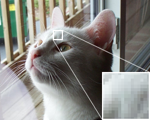

# Tree Report🌲
### If a tree falls in the forest, and no one is around to hear it, does it make a sound?

# The Octree - Oct (8) - tree
An octree is a tree data structure in which each internal node has exactly eight children. Octrees are most often used to partition a three-dimensional space by recursively subdividing it into eight octants. Octrees are often used in 3D graphics and 3D game engines.

  
  Left: Recursive subdivision of a cube into octants. Right: The corresponding octree.
## So what do you use an Octree for, Mickey?

Well I'm glad you asked...

The octree color quantization algorithm, invented by Gervautz and Purgathofer in 1988. The use of octrees for 3D computer graphics was pioneered by Donald Meagher at Rensselaer Polytechnic Institute, described in a 1980 report "Octree Encoding: A New Technique for the Representation, Manipulation and Display of Arbitrary 3-D Objects by Computer"

Octrees are often used in game and animation engines, in particular for ***quantizing*** color values.

## Quantizing? Huh? Izzat that Australian Airlines?

No.

In computer graphics, color quantization or color image quantization is a process that reduces the number of distinct colors used in an image. Done effectively, quantization can render images faster and less costly without degrading the appearance of the image.

  
  An example image in 24-bit RGB color  
  
  The same image reduced to a palette   
  of 16 colors

Octrees are essential to optimizing performance for rendering engines like Pixar's RenderMan. According to Pixar Supervising Technical Director Sanjay Bakshi, [it took] "... 29 hours [of CPU time] to render a single frame of Monsters University." 

### 29 hours/frame * 149,760 frames = 4,340,040 CPU hours! 

## How does it work?

Octrees encode image color data up to nine levels deep. Octrees are used because rgb data is stored in bytes:  23 = 8, and there are three color components in the RGB system~. The node index to branch out from at the top level is determined by a formula that uses the most significant bits of the red, green, and blue color components, e.g. 4r + 2g + b. The next lower level uses the next bit significance, and so on. Less significant bits are sometimes ignored to reduce the tree size.

The algorithm is highly memory efficient because the tree's size can be limited. The bottom level of the octree consists of leaf nodes that accrue color data not represented in the tree; these nodes initially contain single bits. If much more than the desired number of palette colors are entered into the octree, its size can be continually reduced by seeking out a bottom-level node and averaging its bit data up into a leaf node, pruning part of the tree. Once sampling is complete, exploring all routes in the tree down to the leaf nodes, taking note of the bits along the way, will yield approximately the required number of colors.

[octree color quantization](https://observablehq.com/@tmcw/octree-color-quantization#uniqueColors)